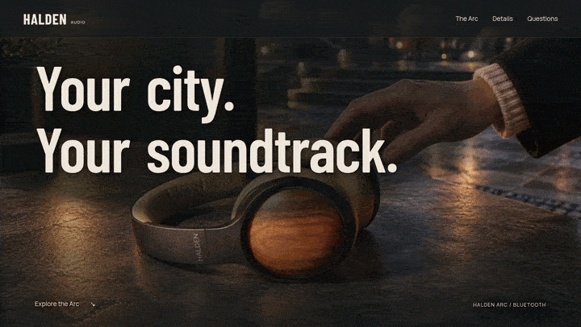

# 10K Websites: a free ChatGPT skill that builds $10,000-looking websites

Install this skill once, and ChatGPT walks you through building a website that looks like a design studio made it. It asks you a few simple questions, pitches ideas, shows you the plan and the exact price, builds the site, checks its own work, and puts it online. You answer questions and pick what you like. You don't need to write code.

Every site opens with a short film that plays as you scroll, and the headline moves with the film.

---

## What the skill does for you

- **Lets you choose how far to go.** Pick **Full throttle** (the strongest models for every step), **Studio** (the strongest model for the design decisions, the everyday model for routine building) or **Focused budget** (the best result for an amount you set). Every level builds a complete, original website.
- **Asks a few simple questions.** It works for your own business or for a client.
- **Researches your real customers** in reviews and forums, then writes your site in the words they actually use.
- **Pitches your opening scene like a film director:** a short story with a real event in it, with the whole page designed around it.
- **Shows you the whole plan and the exact price** (a scene-by-scene Visual Story) before it spends anything, with room for redos.
- **Shows you an early preview** of the headline over the images, a lower section and the phone view, before it makes any video.
- **Lets you review the film in slow motion, frame by frame,** before it builds anything around it.
- **Makes the headline move with the film.** It can even fix words onto a wall, a table or the ground in the scene, so they move like part of the video.
- **Tests the site in a real browser.** It fixes anything that's hard to read or broken, then scores the site against a $10,000 design checklist.
- **Plans the phone version from the start.** It also makes your browser icon and share picture.
- **Puts your site online**, tests it the way Google does, and updates it any time you ask.
- **Optional extras:** a real inbox for your form messages (on your own hosting), more pages, a second language, a brand kit, and a handover kit for clients.

## What you need

| | What | Why |
|---|---|---|
| 1 | The **ChatGPT desktop app** (Mac or Windows) with a paid plan. | The skill runs in Codex, the part of ChatGPT that builds things on your computer. |
| 2 | An **[OpenArt](https://meticsmedia.com/openart-CMAT)*** account with a paid plan | ChatGPT can't make video. OpenArt makes the images and the opening film. The skill quotes the exact price for your site before it makes anything. Full throttle uses the strongest models at high quality and can use several thousand credits for one site. Studio and Focused budget cost less. |
| 3 | **Hostinger** hosting ([Premium plan, extra 10% off](https://meticsmedia.com/hostinger-CMAT)*) | It puts your site online. The plan includes a free domain for the first year, and ChatGPT uploads the site for you through Hostinger's connector. |

The skill posts these links at the right moment during the build, so you don't need to set anything up in advance.

## Install

1. Download **[10k-websites.zip](https://github.com/meticsmedia/10k-websites/releases/latest/download/10k-websites.zip)** (always the latest version).
2. Open the ChatGPT desktop app and switch to **Codex** in the top-left menu.
3. Drag the zip into a chat, type `Install this skill`, and send it.

You don't need to unzip anything. The skill stays installed for every website you build.

## Build your first website

1. Create a new, empty folder for your website and open it in Codex.
2. Start a new chat, type `/`, and click **10k-websites** under "Skills". (The first line in that list starts a "worktree". You don't need that.)
3. Send it. You don't need to type anything else.

ChatGPT checks your setup, asks you a few questions, and guides you from there.

If you pause or run out of usage, come back to the same chat when your limit resets and say `continue`. If you need a new chat, open it in the same folder and pick the skill again. It picks up from the saved plan. A new chat doesn't reset your usage limit.

## Questions

**Does it work on the $20 Plus plan?**
Yes. Studio fits Plus best, because it saves the strongest model for the design decisions. Full throttle works too, but it uses the strongest model for every step and can reach your usage limit before the site is finished. Everything is saved, so you can continue after the limit resets.

**How much does a site cost in OpenArt credits?**
It depends on the level and the story you pick. The skill shows you the exact price, with room for redos, and waits for your OK before it makes anything.

**Can I use my own photos?**
Yes. Drag them in when ChatGPT asks. Phone photos are fine. It keeps your product exactly as it is.

**Can it take online payments or customer accounts?**
No. This skill builds showcase websites. Your button can link to a shop or booking page you already have.

**Can I build sites for clients?**
Yes. Tell the skill the site is for a client. It gives you a preview link to send them and a handover kit at the end.

**Is it really free?**
The skill is free. You pay for your ChatGPT plan, OpenArt credits for images and video, and hosting.

## Credits

Made by [Metics Media](https://www.youtube.com/@MeticsMedia). The scroll engine, film-type engine, effects and tools are original to this skill. At run time the tools install [Playwright](https://github.com/microsoft/playwright), [sharp](https://github.com/lovell/sharp), [Transformers.js](https://github.com/huggingface/transformers.js) and, for the launch report, [Lighthouse](https://github.com/GoogleChrome/lighthouse). They download the [Depth Anything V2 Small](https://huggingface.co/onnx-community/depth-anything-v2-small) model (Apache-2.0) only when a depth scene is used. None of them are bundled here.

\* Partner links. They give you the discount shown, and they support Metics Media at no extra cost to you.
